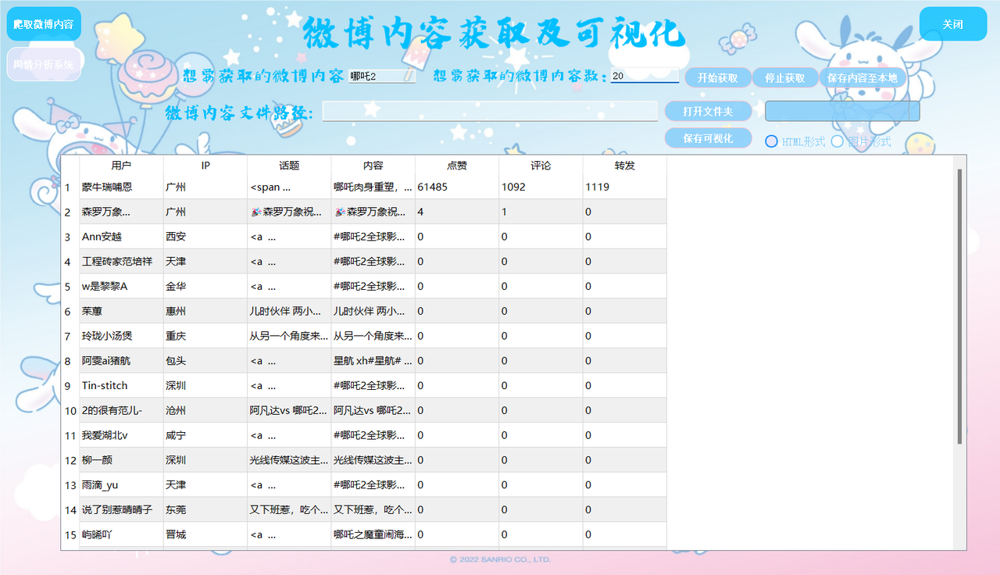
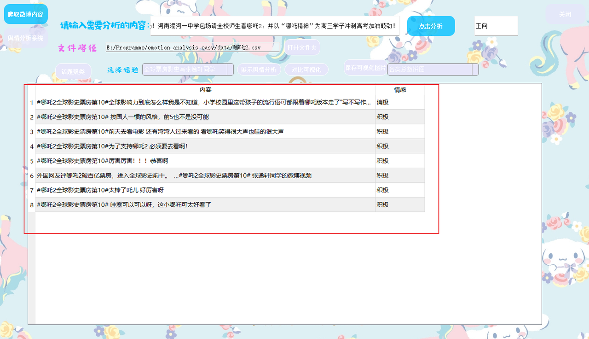
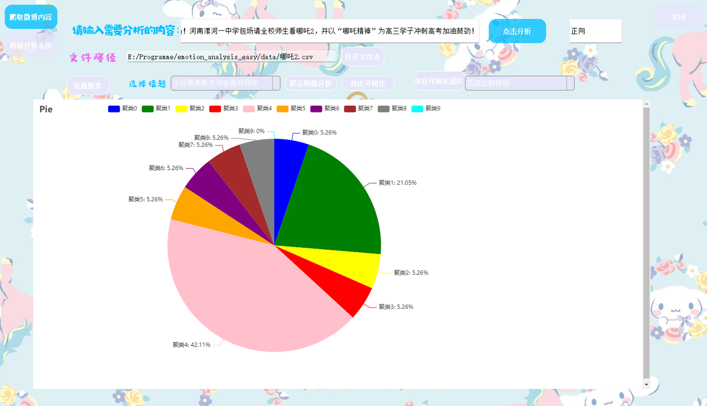
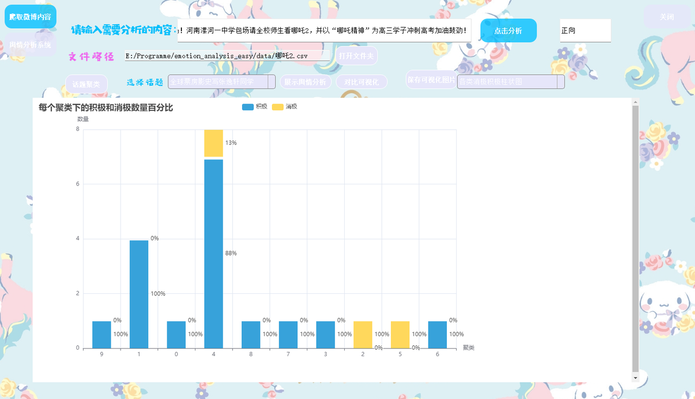

# 情感分析系统 (Emotion Analysis System)

一个基于BERT模型的中文情感分析系统，支持微博数据爬取、情感分析、数据可视化和图形界面操作。

## 🌟 功能特性

### 核心功能
- **智能情感分析**：基于BERT中文预训练模型进行情感分类（正向、负向、中性）
- **数据爬取**：自动爬取微博数据进行情感分析
- **可视化界面**：基于PyQt5的桌面应用程序，提供友好的用户界面
- **数据处理**：数据清洗、聚类分析、结果可视化
- **图表生成**：生成多种可视化图表展示分析结果

### 技术特点
- 使用BERT中文预训练模型，准确率高
- 支持批量文本处理和单文本预测
- 集成数据爬取、处理、分析、可视化完整流程
- 提供直观的桌面应用界面

## 📁 项目结构

```
emotion_analysis_system/
├── bert/                      # BERT模型相关代码
│   ├── train_model.py        # 模型训练脚本
│   ├── predict.py            # 模型预测脚本
│   └── data/                 # 训练数据
├── img/                      # 界面截图
├── data/                     # 数据文件
├── results/                  # 分析结果
├── main.py                   # 主程序界面
├── second.py                 # 第二个界面
├── spider.py                 # 微博爬虫
├── predict.py                # 预测脚本
├── test.py                   # 测试脚本
├── viwe.py                   # 可视化模块
├── all_Thread.py             # 多线程处理
├── topic.py                  # 主题分析
├── use.py                    # 项目启动文件
└── requirements.txt          # 依赖包列表
```

## 🛠️ 安装说明

### 环境要求
- Python 3.7+
- PyQt5
- PyTorch
- Transformers

### 安装步骤

1. **克隆项目**
   ```bash
   git clone https://github.com/Pytorchlover/emotion_analysis_system.git
   cd emotion_analysis_system
   ```

2. **安装依赖**
   ```bash
   pip install -r requirements.txt
   ```

3. **下载预训练模型**
   - 需要下载BERT中文预训练模型
   - 将模型文件放置在 `bert-base-chinese/` 目录下

## 🚀 使用方法

### 模型训练详细指南

由于GitHub文件大小限制，预训练模型权重无法上传，请按以下完整步骤训练自己的模型：

### 步骤1：下载BERT预训练模型

#### 方式一：使用transformers自动下载（推荐）
```python
from transformers import BertTokenizer, BertModel

# 自动下载并缓存到本地
tokenizer = BertTokenizer.from_pretrained('bert-base-chinese')
model = BertModel.from_pretrained('bert-base-chinese')

# 查看下载路径
print(tokenizer.name_or_path)  # 通常会在 ~/.cache/huggingface/hub 目录
```

#### 方式二：从魔搭社区下载（国内推荐）
```python
# 安装modelscope
pip install modelscope

# 下载模型
from modelscope import snapshot_download
model_dir = snapshot_download('bert-base-chinese', cache_dir='./bert-base-chinese')
print(f"模型下载到: {model_dir}")
```

#### 方式三：手动下载（网络受限时）
1. 访问 HuggingFace: https://huggingface.co/bert-base-chinese
2. 或访问 魔搭社区: https://modelscope.cn/models/bert-base-chinese
3. 下载以下必需文件到 `bert-base-chinese/` 目录：
   - config.json (配置文件)
   - pytorch_model.bin 或 model.safetensors (模型权重)
   - vocab.txt (词汇表)
   - tokenizer_config.json (分词器配置)


## 步骤2：准备训练数据

#### 数据格式要求
创建 `bert/data/train.csv` 文件：
```csv
text,label
"这个电影太好看了，强烈推荐",2
"今天心情不错，天气也很好",2  
"一般般，没什么特别的感觉",1
"这个产品质量太差了，很失望",0
"服务态度极其恶劣",0
```

#### 标签体系（三分类）
- 0: 负面情感 (Negative)
- 1: 中性情感 (Neutral) 
- 2: 正面情感 (Positive)

#### 数据预处理
参考 `bert/data/data_process.py` 进行数据清洗和格式化。

### 步骤3：配置训练参数

修改 `bert/train_model.py` 中的关键参数：
```python
# 训练参数配置
batch_size = 16      # 根据GPU内存调整
epochs = 10         # 训练轮数
learning_rate = 2e-5 # 学习率

# 模型路径配置（修改为你的实际路径）
pretrained_name = './bert-base-chinese'  # 预训练模型路径
```

### 步骤4：开始训练

```bash
# 进入bert目录
cd bert

# 运行训练脚本
python train_model.py

# 如果使用GPU训练，确保CUDA可用
export CUDA_VISIBLE_DEVICES=0  # 使用第一块GPU
```

### 步骤5：模型验证和部署

训练完成后，模型会自动保存在 `bert/model/` 目录下。验证模型效果：

```python
# 测试训练好的模型
python train_model.py  # 脚本中包含测试代码

# 或者手动测试
from bert.predict import bert_predict
result = bert_predict("这个产品很好用")
print(f"情感分析结果: {result}")
```

### 步骤6：更新预测配置

修改 `bert/predict.py` 中的模型路径：
```python
# 加载训练好的模型权重
net.load_state_dict(torch.load('./bert/model/your_trained_model.parameters', map_location='cpu'), False)

# 确保tokenizer使用正确的词汇表
tokenizer = BertTokenizer.from_pretrained('./bert-base-chinese')
```

### 📱 图形界面使用流程

#### 1. 启动应用程序
```bash
python use.py
```

#### 2. 完整使用流程

**步骤一：数据获取**
1. 在主界面输入关键词（如"哪吒2"）
2. 设置爬取数量（如20条）
3. 点击"开始爬取"按钮
4. 等待爬取完成，数据将显示在表格中

**步骤二：数据分析**
1. 点击"打开文件夹"选择数据文件
2. 选择分析类型（聚类分析、情感分析等）
3. 点击"开始分析"进行数据处理
4. 查看分析结果

**步骤三：可视化展示**
1. 选择可视化类型（饼图、柱状图、词云等）
2. 点击"生成图表"
3. 查看和保存可视化结果

**步骤四：结果导出**
1. 点击"保存可视化"导出图表
2. 点击"保存数据"导出分析结果
3. 选择保存位置和文件格式

### 💻 命令行使用方法

#### 单文本情感分析
```python
from bert.predict import bert_predict

# 单文本预测
text = "今天天气真不错！"
result = bert_predict(text)
print(f"情感分析结果: {result}")
```

#### 批量数据爬取
```python
from spider import weibo_data
import csv

# 爬取微博数据
keyword = "情感分析"
with open('data/data.csv', 'w', newline='', encoding='utf-8') as csvfile:
    writer = csv.DictWriter(csvfile, fieldnames=fieldnames)
    writer.writeheader()
    data = weibo_data(writer, keyword, 100)
```

#### 模型训练
```bash
cd bert
python train_model.py
```

### 📊 详细操作指南

| 功能 | 操作步骤 | 说明 |
|------|----------|------|
| **数据爬取** | 1. 输入关键词<br>2. 设置数量<br>3. 点击爬取 | 自动获取微博数据 |
| **文件上传** | 1. 点击"选择文件"<br>2. 选择CSV文件<br>3. 确认上传 | 支持本地数据导入 |
| **情感分析** | 1. 输入文本<br>2. 点击"点击分析"<br>3. 查看结果 | 实时情感分析 |
| **聚类分析** | 1. 选择数据<br>2. 设置聚类参数<br>3. 开始聚类 | 自动文本聚类 |
| **可视化** | 1. 选择图表类型<br>2. 设置参数<br>3. 生成图表 | 多种图表类型 |

## 🎯 界面功能

### 主界面功能
1. **数据爬取**：输入关键词和数量，自动爬取微博数据
2. **文件上传**：支持本地CSV文件上传
3. **数据展示**：表格形式展示爬取或上传的数据
4. **数据导出**：支持结果导出为CSV文件

### 分析界面功能
1. **情感分析**：对选定数据进行情感分析
2. **聚类分析**：对数据进行聚类分析
3. **可视化图表**：生成情感分布图、词云图等
4. **结果保存**：保存分析结果和可视化图表

## 📊 模型性能

- **模型类型**：BERT-base-Chinese
- **分类类别**：正向、负向、中性
- **训练数据**：中文微博情感数据集
- **准确率**：约85%+（具体性能取决于数据集）

## 🔧 核心模块说明

### 1. 情感分析模块 (`bert/`)
- `train_model.py`：模型训练脚本
- `predict.py`：情感预测接口
- 支持批量处理和单条预测

### 2. 数据爬取模块 (`spider.py`)
- 微博数据爬取
- 数据清洗和预处理
- 支持关键词搜索

### 3. 可视化模块 (`viwe.py`)
- 数据可视化图表生成
- 支持多种图表类型
- 集成ECharts图表库

### 4. 界面模块 (`main.py`, `second.py`)
- PyQt5桌面应用界面
- 直观的用户交互
- 实时数据展示

## 🎨 界面截图

> **注意**：界面截图已保存在 `img/` 文件夹中，包含以下文件：
> - `1.PNG` - 主界面截图
> - `2.PNG` - 数据展示界面
> - `4.PNG` - 可视化图表界面
> - `6.png` - 情感分析界面
> - `9.png` - 情感分析结果
> - `10.png` - 饼图分析
> - `11.png` - 柱状图分析

### 🖼️ 界面展示

<div align="center">
  
**主界面 - 微博内容获取及可视化**
<br/>


**数据展示界面 - 爬取结果展示**
<br/>


**可视化图表界面 - 地区分布分析**
<br/>


**情感分析界面 - 智能文本分析**
<br/>


**情感分析结果 - 实时分析结果**
<br/>


**数据可视化分析图表**
<br/>



</div>

### 主要功能展示

#### 1. 数据爬取功能
- 支持输入关键词和爬取数量
- 提供开始爬取、停止爬取、保存可视化等功能
- 界面采用可爱的卡通风格设计，用户体验友好

#### 2. 数据展示功能
- 显示用户、IP地址、话题、内容、点赞数、评论数、转发数等详细信息
- 支持数据的查看和管理
- 清晰的表格布局，便于数据分析

#### 3. 可视化图表功能
- 生成各省份用户数量的可视化图表
- 采用多种图表形式，直观展示数据分布
- 支持多种图表类型切换

#### 4. 情感分析功能
- 提供文本输入框，支持单条文本分析
- 基于BERT模型进行情感分类
- 实时显示分析结果（正向/负向/中性）

#### 5. 聚类分析功能
- 对文本内容进行自动聚类
- 显示聚类结果和统计信息
- 支持聚类结果的可视化展示

## 📈 使用场景

1. **社交媒体情感监控**：监控品牌或产品的网络情感反馈
2. **舆情分析**：分析公众对特定话题的情感倾向
3. **市场调研**：了解用户对产品或服务的情感态度
4. **学术研究**：中文情感分析研究和教学

## 📄 许可证

本项目采用 MIT 许可证 - 查看 [LICENSE](LICENSE) 文件了解详情

## 📞 联系方式

- 项目作者：[心无旁骛～]
- CSDN：[https://blog.csdn.net/m0_63007797?spm=1000.2115.3001.5343]
- 项目地址：[https://github.com/Pytorchlover/emotion_analysis_system]

## 🔮 未来规划

- [ ] 支持更多情感分类类别
- [ ] 增加更多数据源支持
- [ ] 优化模型性能
- [ ] 增加Web界面版本
- [ ] 支持实时情感分析

---

⭐ 如果这个项目对您有帮助，请给它一个星标！
